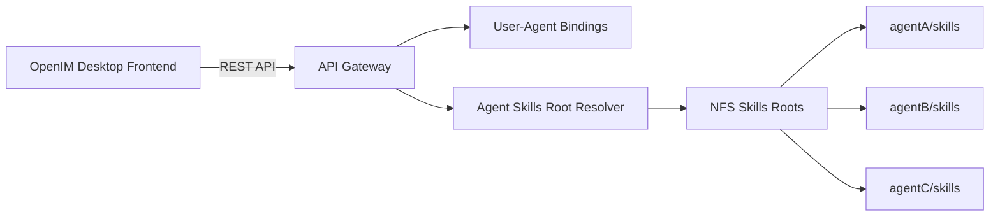

# OpenIM Skills 文件穿透方案

## 1. 背景

OpenIM 桌面端准备新增「技能 / Skills」功能。

这里的 Skills 第一阶段不做技能市场，也不做模拟技能列表，而是做一个类似网盘的文件管理能力：

- 每个智能体拥有独立的 skills 存储空间。
- 用户在 IM 桌面端选择某个智能体后，可以浏览和管理该智能体的 skills 文件。
- 前端不直接接触真实服务器路径，只通过前端当前连接的 API Gateway 做文件穿透。
- 每个智能体的 skills 独立目录物理上统一存放在 NFS 上，由 API Gateway 根据智能体标识映射到对应目录。

核心目标：

```text
OpenIM 桌面端
  -> 选择智能体
  -> 进入该智能体的 skills 空间
  -> 浏览 / 查看 / 编辑 / 上传 / 下载 / 删除 / 重命名 / 移动文件
```

## 2. 核心原则

### 2.1 按智能体隔离

Skills 空间必须以智能体为边界。

不能做成全局共享文件列表：

```text
错误模型：
skills/
  skill-a
  skill-b
```

应该做成：

```text
正确模型：
agent-a/
  skills/
agent-b/
  skills/
agent-c/
  skills/
```

前端所有文件操作都必须带智能体标识。

### 2.2 API Gateway + NFS 存储模型

本文中的「后端」主要指 OpenIM 前端当前连接的 API Gateway 及其后续服务层。

当前阶段 skills 存储统一位于 NFS。推荐整体链路：

```text
OpenIM 桌面端前端
  -> API Gateway
  -> 校验当前用户与智能体绑定关系
  -> 根据 agentID 映射到 NFS 上该智能体的 skills 根目录
  -> 在该根目录内执行文件操作
```

架构示意：



推荐后端维护或能够计算如下映射：

```text
agentID -> nfsSkillsRoot
```

示例：

```text
/nfs/openclaw/agents/{agentID}/skills
/nfs/skills/{agentID}
```

以上仅是后端内部路径示例，前端不感知、不展示、不拼接。

### 2.3 前端不拼真实路径

前端只传：

```text
agentID 或 agentUserID
relativePath
operation
```

API Gateway 负责：

```text
agentID -> 找到 NFS 上该智能体的 skills 根目录
relativePath -> 映射到 skills 根目录内的文件/文件夹
```

前端不应该看到、存储、拼接类似下面的真实路径：

```text
/data/openclaw/workspace/xxx/skills
/data/shared/skills
C:\xxx\skills
```

### 2.4 复用现有用户与智能体绑定关系

现有 OpenIM 前端中，「通讯录 -> 智能体」列表已经通过后端绑定关系获取。

当前逻辑位于：

```text
src/api/services/agent.ts
src/store/contact.ts
src/pages/contact/agents/index.tsx
```

核心流程：

```text
getUserAgentBindings()
  -> 后端返回当前用户绑定的 agentID 列表
getAgentListPage()
  -> 获取智能体分页列表
前端用 binding.agentID 过滤 Agent.userID
  -> 得到当前用户可见的智能体列表 useContactStore().agents
```

因此 Skills 页面不需要重新设计一套「用户可以访问哪些智能体」的前端逻辑，第一版可以复用：

```text
useContactStore().agents
getAgentsListByReq()
```

也就是说：

```text
用户在通讯录智能体列表中能看到哪些智能体
用户在 Skills 页面中就能选择哪些智能体
```

但这只是前端展示过滤。API Gateway 仍必须在每次文件操作时基于当前登录用户和 `agentID` 再做一次绑定关系校验，不能信任前端传参。

### 2.5 类网盘模型优先

第一阶段按文件系统对象设计，而不是按「技能对象」设计。

原因：

- 现在不应提前绑定某一种 skill schema。
- 一个 skill 可能是一个目录，也可能是一个 `.md`、`.json`、`.py` 或多个文件组合。
- 文件管理能力是底座，后续可以在此基础上做技能解析、发布、运行、校验等功能。

## 3. 前端交互模型

### 3.1 页面结构

建议 OpenIM 桌面端新增一个「技能」入口。

页面分三栏：

```text
左栏：智能体列表
中栏：选中智能体的 skills 文件树 / 文件列表
右栏：文件详情 / 编辑器 / 操作面板
```

### 3.2 操作流程

```text
进入 Skills 页面
  -> 加载当前用户可访问的智能体列表
  -> 用户选择智能体
  -> 请求该智能体 skills 空间状态
  -> 列出根目录 /
  -> 用户进入目录或选择文件
  -> 查看 / 编辑 / 上传 / 删除等操作
```

### 3.3 多智能体场景

多个智能体时，前端必须始终展示「当前智能体」。

例如：

```text
当前空间：张老师 / skills
```

不建议默认选择第一个智能体，避免误操作。

推荐逻辑：

- 从全局左侧「技能」入口进入：先显示智能体列表，要求用户选择。
- 如果未来支持从某个智能体聊天窗口跳转：可以默认进入该聊天智能体的 skills 空间。

## 4. API 总体约定

### 4.1 API Gateway 路径建议

建议由 API Gateway 提供类似下面的 API 前缀：

```http
/api/v1/agents/{agentID}/skills/storage
/api/v1/agents/{agentID}/skills/files
```

也可以放在现有 agent 服务下，例如：

```http
/agent/{agentID}/skills/...
```

最终路径可由后端决定，但需要保持语义：

```text
智能体 + skills + 文件操作
```

前端统一调用 API Gateway，不直接访问 NFS、Pod、SSH 或 OpenClaw 内部目录。

### 4.2 agentID 约定

前端目前已有智能体对象：

```ts
type Agent = {
  userID: string
  nickname: string
  faceURL: string
  url: string
  key: string
  idtentity: string
  model: string
  prompts: string
  createTime: number
}
```

现有绑定接口里也存在：

```ts
type AgentBinding = {
  userID: string
  agentID: string
  createTime: number
}
```

现有前端过滤逻辑使用：

```text
binding.agentID == Agent.userID
```

也就是说，当前系统里「绑定关系返回的 agentID」与「智能体列表里的 Agent.userID」对齐。

Skills 文件 API 建议沿用这个标识。

建议 API 命名中使用：

```text
agentID
```

并在后端文档中明确：

```text
agentID = Agent.userID = AgentBinding.agentID
```

前端不应同时猜测多个字段。后端如果未来改成独立智能体主键，需要同步更新 agent 列表和绑定关系中的字段契约。

### 4.3 绑定关系校验

每次 Skills 文件 API 请求，API Gateway 都必须基于当前登录用户做校验：

```text
currentUserID 是否绑定 agentID
```

建议校验逻辑与现有接口保持一致：

```text
/agent/user_bindings
```

如果当前用户未绑定该智能体，则返回：

```http
403 Forbidden
```

前端只负责展示已绑定智能体列表，不能作为安全边界。

### 4.4 鉴权约定（不需要 X-API-Key）

Skills 是面向所有 IM 用户的通用功能，不存在「A 用户有、B 用户没有」的功能级开关，因此不需要任何应用级 / 功能级的额外鉴权。

鉴权约定如下：

| 项 | 结论 |
| --- | --- |
| `X-API-Key` | 不需要，去掉。它是主产品网关的应用级门票，对全员功能多余；IM 客户端本身也不持有该 key |
| `token`（IM/Chat token） | 必带，唯一作用是让后端识别当前用户身份 |
| 权限判断 | 权限 = 人和智能体的绑定关系，后端用 token 查绑定即可，不需要新增权限体系 |
| 校验位置 | 必须在服务端做，前端列表过滤不算安全边界 |
| 校验依据 | 复用现有 `/agent/user_bindings` 逻辑 |
| 未绑定访问 | 返回 403 |

要点：

- **权限 = 绑定**：用户没绑定某智能体就在 IM 里看不到它、无从操作；绑定了就是有权限。直接复用现有绑定关系，不需要再叠加任何鉴权层。
- **token 不是额外鉴权**：它只用来告诉后端「你是谁」，后端据此查「你绑定了哪些智能体」来落地「绑定即权限」。
- Skills 接口与现有 `/agent/page`、`/agent/user_bindings` 保持一致——那两个接口本来就只用 `token`、不需要 `X-API-Key`。

> 详见独立说明文档 `skills-auth-decision.md`。

## 5. API 详细设计

### 5.1 获取 skills 空间状态

用于判断该智能体是否有 skills 空间、是否可写、是否需要初始化。

```http
GET /api/v1/agents/{agentID}/skills/storage
```

响应：

```json
{
  "success": true,
  "data": {
    "agentID": "agent_001",
    "agentName": "张老师",
    "rootName": "skills",
    "available": true,
    "readonly": false,
    "initialized": true,
    "updatedAt": "2026-06-05T08:00:00Z"
  }
}
```

字段说明：

| 字段 | 类型 | 说明 |
| --- | --- | --- |
| `agentID` | string | 智能体 ID |
| `agentName` | string | 智能体名称 |
| `rootName` | string | 展示用根目录名称，通常为 `skills` |
| `available` | boolean | 当前 skills 空间是否可访问 |
| `readonly` | boolean | 是否只读 |
| `initialized` | boolean | skills 空间是否已初始化 |
| `updatedAt` | string | 最近更新时间 |

### 5.2 初始化 skills 空间

如果后端允许用户为智能体创建 skills 空间：

```http
POST /api/v1/agents/{agentID}/skills/storage/init
```

响应：

```json
{
  "success": true,
  "data": {
    "agentID": "agent_001",
    "initialized": true
  }
}
```

如果后端统一预创建空间，也可以不提供这个接口。

### 5.3 列目录

```http
GET /api/v1/agents/{agentID}/skills/files?path=/
```

响应：

```json
{
  "success": true,
  "data": {
    "agentID": "agent_001",
    "path": "/",
    "items": [
      {
        "name": "image-gen",
        "path": "/image-gen",
        "type": "directory",
        "size": 0,
        "updatedAt": "2026-06-05T08:00:00Z"
      },
      {
        "name": "README.md",
        "path": "/README.md",
        "type": "file",
        "size": 2048,
        "updatedAt": "2026-06-05T08:01:00Z",
        "mimeType": "text/markdown",
        "editable": true
      }
    ]
  }
}
```

目录项字段：

| 字段 | 类型 | 说明 |
| --- | --- | --- |
| `name` | string | 文件或目录名 |
| `path` | string | skills 根目录内的相对路径，以 `/` 开头 |
| `type` | `file` / `directory` | 类型 |
| `size` | number | 文件大小，目录可为 0 |
| `updatedAt` | string | 更新时间 |
| `mimeType` | string | 文件 MIME 类型 |
| `editable` | boolean | 是否允许文本编辑 |

### 5.4 读取文件内容

用于读取文本文件。

```http
GET /api/v1/agents/{agentID}/skills/files/content?path=/README.md
```

响应：

```json
{
  "success": true,
  "data": {
    "agentID": "agent_001",
    "path": "/README.md",
    "name": "README.md",
    "encoding": "utf-8",
    "content": "# skill readme",
    "size": 2048,
    "updatedAt": "2026-06-05T08:01:00Z",
    "etag": "abc123"
  }
}
```

说明：

- 只建议读取文本文件。
- 二进制文件不通过该接口返回 `content`，应走下载接口。
- 建议返回 `etag` 或版本号，用于保存时做冲突检测。

### 5.5 保存文件内容

```http
PUT /api/v1/agents/{agentID}/skills/files/content
Content-Type: application/json
```

请求：

```json
{
  "path": "/README.md",
  "content": "# updated skill readme",
  "encoding": "utf-8",
  "etag": "abc123"
}
```

响应：

```json
{
  "success": true,
  "data": {
    "path": "/README.md",
    "updatedAt": "2026-06-05T08:05:00Z",
    "etag": "def456"
  }
}
```

冲突建议：

- 如果 `etag` 不匹配，返回 `409 Conflict`。
- 前端提示用户文件已被更新，需要刷新后再编辑。

### 5.6 新建文件或文件夹

```http
POST /api/v1/agents/{agentID}/skills/files
Content-Type: application/json
```

新建文件：

```json
{
  "parentPath": "/image-gen",
  "name": "skill.md",
  "type": "file"
}
```

新建文件夹：

```json
{
  "parentPath": "/",
  "name": "new-skill",
  "type": "directory"
}
```

响应：

```json
{
  "success": true,
  "data": {
    "name": "skill.md",
    "path": "/image-gen/skill.md",
    "type": "file",
    "size": 0,
    "updatedAt": "2026-06-05T08:10:00Z"
  }
}
```

### 5.7 删除文件或文件夹

```http
DELETE /api/v1/agents/{agentID}/skills/files
Content-Type: application/json
```

请求：

```json
{
  "path": "/image-gen/skill.md"
}
```

响应：

```json
{
  "success": true
}
```

说明：

- 删除文件夹时，后端需要明确是否允许递归删除。
- 推荐第一版允许递归删除，但前端必须弹窗确认。
- 后端可要求请求中带 `recursive: true`。

可选请求：

```json
{
  "path": "/image-gen",
  "recursive": true
}
```

### 5.8 重命名 / 移动

重命名和移动可以统一成 move 接口。

```http
PATCH /api/v1/agents/{agentID}/skills/files/move
Content-Type: application/json
```

请求：

```json
{
  "fromPath": "/old-name.md",
  "toPath": "/new-name.md"
}
```

跨目录移动：

```json
{
  "fromPath": "/a/skill.md",
  "toPath": "/b/skill.md"
}
```

响应：

```json
{
  "success": true,
  "data": {
    "fromPath": "/old-name.md",
    "toPath": "/new-name.md"
  }
}
```

### 5.9 上传文件

```http
POST /api/v1/agents/{agentID}/skills/files/upload
Content-Type: multipart/form-data
```

表单字段：

```text
parentPath=/
overwrite=false
file=<binary>
```

响应：

```json
{
  "success": true,
  "data": {
    "name": "tool.py",
    "path": "/tool.py",
    "type": "file",
    "size": 10240,
    "updatedAt": "2026-06-05T08:20:00Z",
    "mimeType": "text/x-python",
    "editable": true
  }
}
```

覆盖策略：

- 如果 `overwrite=false` 且目标已存在，返回 `409 Conflict`。
- 前端提示是否覆盖。

### 5.10 下载文件

```http
GET /api/v1/agents/{agentID}/skills/files/download?path=/tool.py
```

响应：

```text
文件流
```

建议响应头：

```http
Content-Disposition: attachment; filename="tool.py"
Content-Type: application/octet-stream
```

### 5.11 搜索文件（可选）

如果 skills 文件较多，可以后续增加搜索。

```http
GET /api/v1/agents/{agentID}/skills/files/search?keyword=query
```

第一版可以不做。

## 6. 前端类型建议

```ts
export type SkillFileType = "file" | "directory";

export interface SkillStorageInfo {
  agentID: string;
  agentName: string;
  rootName: string;
  available: boolean;
  readonly: boolean;
  initialized: boolean;
  updatedAt?: string;
}

export interface SkillFileItem {
  name: string;
  path: string;
  type: SkillFileType;
  size: number;
  updatedAt?: string;
  mimeType?: string;
  editable?: boolean;
}

export interface SkillFileContent {
  agentID: string;
  path: string;
  name: string;
  encoding: "utf-8";
  content: string;
  size: number;
  updatedAt?: string;
  etag?: string;
}
```

## 7. 前端页面状态建议

```ts
currentAgent: Agent | null
storageInfo: SkillStorageInfo | null
currentPath: string
directoryItems: SkillFileItem[]
selectedFile: SkillFileItem | null
fileContent: SkillFileContent | null
dirty: boolean
loading: boolean
saving: boolean
```

状态流：

```text
选择智能体
  -> getStorageInfo(agentID)
  -> listFiles(agentID, "/")
  -> 点击目录 listFiles(agentID, path)
  -> 点击文本文件 readFile(agentID, path)
  -> 编辑保存 saveFile(agentID, path, content, etag)
```

## 8. 权限与安全要求

API Gateway 必须兜底，前端不能作为安全边界。

### 8.1 智能体权限校验

API Gateway 需要校验当前用户是否有权访问该智能体。

建议规则：

- 鉴权只用 `token`，**不需要 `X-API-Key`**（详见 §4.4）。
- 权限 = 绑定关系：当前用户必须通过现有「人和智能体绑定关系」绑定该智能体（或拥有管理权限）。
- 校验依据应与现有 `/agent/user_bindings` 逻辑一致。
- 无权限返回 `403 Forbidden`。

### 8.2 路径逃逸防护

API Gateway 必须禁止：

```text
../
..\
绝对路径
软链接逃逸
URL 编码绕过
```

所有路径必须被规范化到该智能体在 NFS 上的 skills 根目录之内。

### 8.3 根目录隔离

任何请求都只能访问：

```text
resolvedSkillsRoot(agentID)
```

下面的文件。

不能通过相对路径访问其他智能体目录、公共目录、NFS 其他目录或系统目录。

NFS 场景下建议后端内部流程：

```text
root = resolveNfsSkillsRoot(agentID)
target = normalize(resolve(root, relativePath))
assert target is inside root
```

如遇软链接，建议禁止跟随；如果必须跟随，解析最终真实路径后仍需再次校验其位于 `root` 内。

### 8.4 可编辑文件类型限制

建议第一版只允许在线编辑文本文件：

```text
.md
.txt
.json
.yaml
.yml
.py
.ts
.tsx
.js
.jsx
.sh
.ps1
```

二进制文件允许上传、下载、删除，但不在线编辑。

### 8.5 文件大小限制

建议：

- 在线预览/编辑最大 1 MB 或 2 MB。
- 上传大小上限由后端配置。
- 超过可编辑大小的文件只允许下载。

### 8.6 并发编辑冲突

建议使用 `etag` 或 `updatedAt` 做乐观锁。

保存时前端带上读取时的 `etag`。

如果文件已变化：

```http
409 Conflict
```

前端提示刷新。

### 8.7 NFS 写入要求

NFS 上保存文件时建议使用原子写入策略：

```text
写入临时文件 -> flush/sync -> rename 覆盖目标文件
```

避免前端读取到半写入文件。

如果后端部署多个实例同时操作同一份 NFS 数据，建议使用 `etag`、`mtime` 或文件 hash 做乐观锁，必要时在服务端加文件级锁。

## 9. 错误码建议

| HTTP 状态 | 场景 |
| --- | --- |
| `400` | 参数错误、路径非法 |
| `401` | 未登录 |
| `403` | 无权访问该智能体或该文件 |
| `404` | 智能体不存在、skills 空间不存在、文件不存在 |
| `409` | 文件已存在、保存冲突 |
| `413` | 文件过大 |
| `415` | 不支持在线编辑的文件类型 |
| `500` | 服务端错误 |

统一错误响应建议：

```json
{
  "success": false,
  "error": {
    "code": "FILE_CONFLICT",
    "message": "文件已被其他操作更新，请刷新后重试"
  }
}
```

## 10. 前后端职责划分

### 10.1 前端负责

- 展示智能体列表。
- 维护当前选中的智能体。
- 展示目录树和文件列表。
- 文本文件查看、编辑和保存。
- 上传、下载、删除、重命名、移动等交互。
- 对危险操作弹确认框。
- 不使用模拟数据。
- 不拼真实路径。

### 10.2 API Gateway / 后端服务层负责

- 根据当前用户和 `agentID` 校验现有用户-智能体绑定关系。
- 根据 `agentID` 解析 NFS 上该智能体 skills 根目录。
- 做路径规范化和路径逃逸防护。
- 在对应 NFS 目录内执行真实文件系统操作。
- 返回目录项、文件内容、文件流。
- 控制文件大小、文件类型和并发冲突。
- 必要时记录审计日志：用户、智能体、相对路径、操作类型、时间、结果。

## 11. 第一阶段交付边界

第一阶段建议做：

- 智能体列表选择。
- skills 空间状态查询。
- 目录浏览。
- 文本文件查看。
- 文本文件编辑保存。
- 新建文件 / 文件夹。
- 上传 / 下载。
- 重命名 / 移动 / 删除。
- 空状态与错误提示。

第一阶段不做：

- 技能运行。
- 技能发布。
- 技能市场。
- 跨智能体同步。
- 公共 skills 空间。
- 模拟技能数据。

## 12. 推荐最终定义

一句话定义：

```text
OpenIM Skills 第一阶段是“按智能体隔离的 skills 文件管理器”，前端提供类网盘交互，后端提供基于 agentID + relativePath 的文件穿透 API。
```

这套方案可以支持当前的文件穿透需求，也为后续「技能解析、技能执行、技能发布」保留扩展空间。
